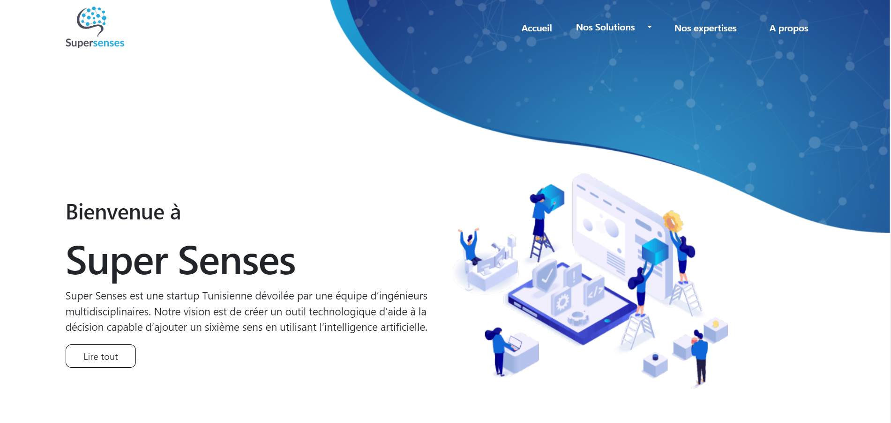
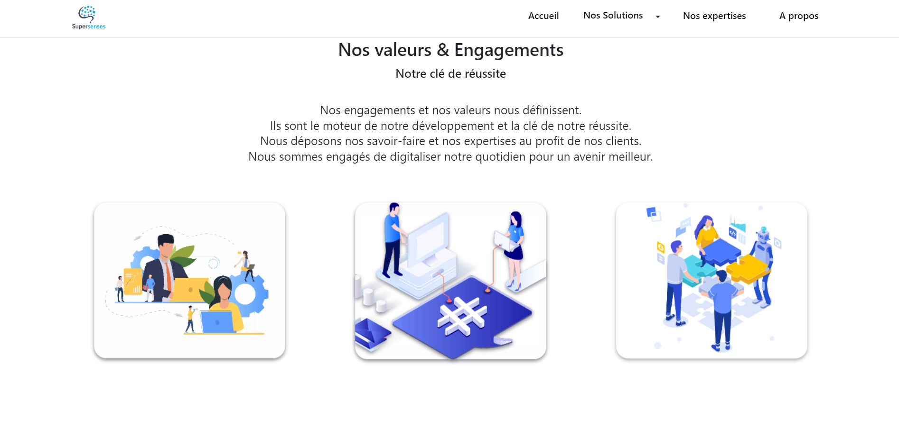
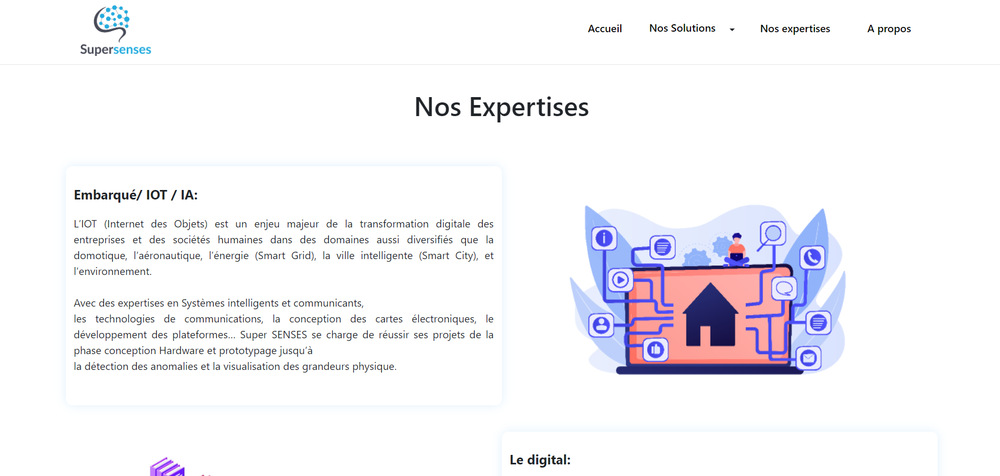
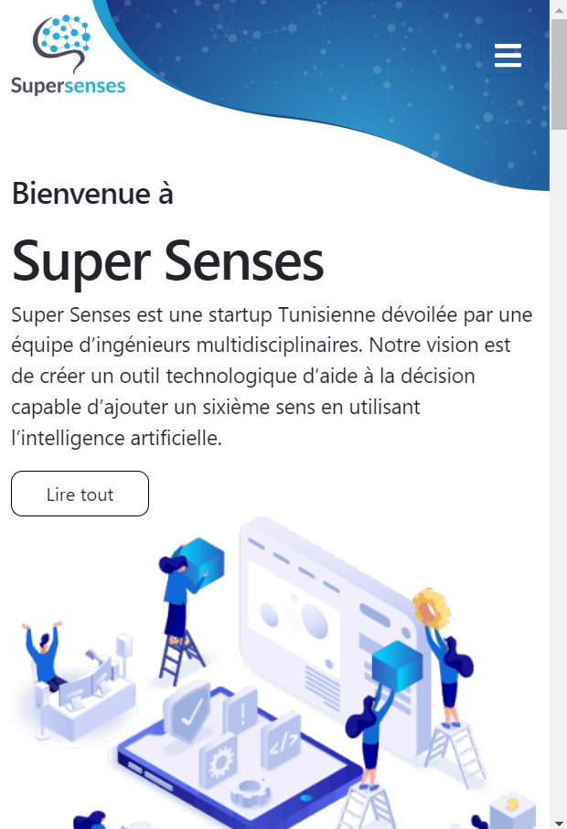

# Super Senses Web Application

## Overview

The Super Senses Web Application is a dynamic web application developed using ReactJS for the frontend and ExpressJS for the backend. This project was created as part of a summer internship with a college. The application is designed to provide a seamless and interactive user experience, and it is currently deployed and accessible online.

## Features

- **User Interface**: Modern and responsive UI built with ReactJS.
- **Backend Integration**: Robust backend API services using ExpressJS.
- **Deployment**: Hosted online server.

## Technologies

- **Frontend**: ReactJS
- **Backend**: ExpressJS
- **Database**: MongoDB

## Project Screenshots

Here are some screenshots of the Super Senses web application:

*Homepage of the application*

